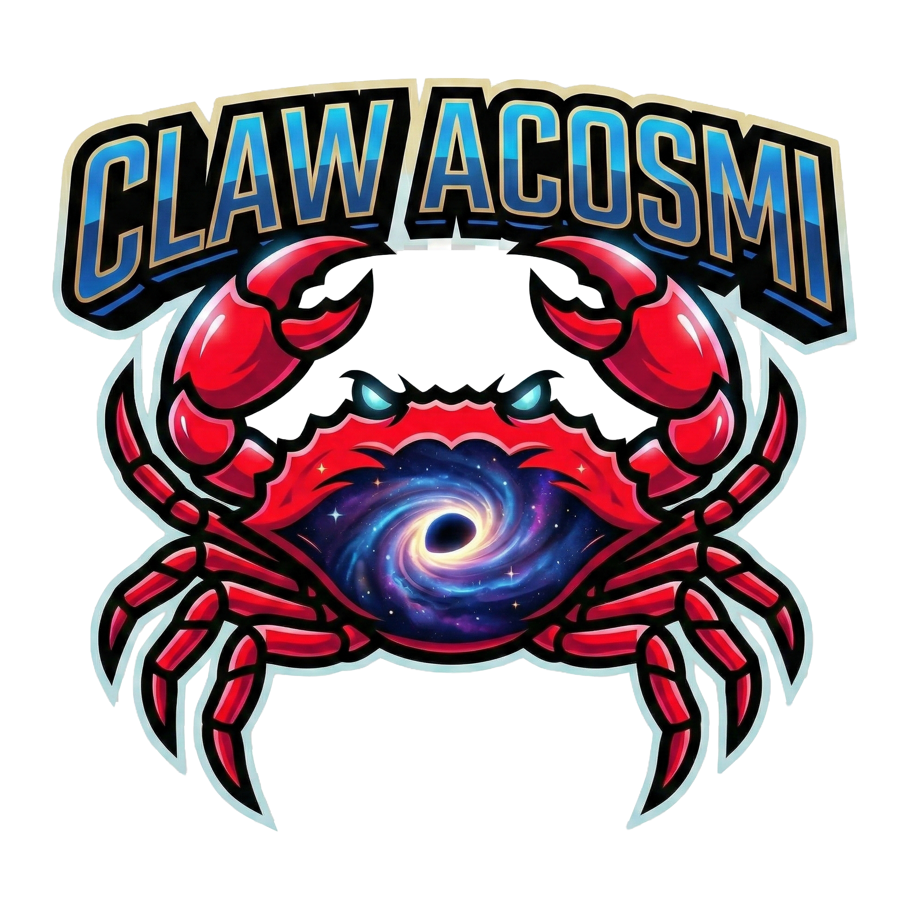

<div align="center">

  
  
# <span style="color: #c9ccc6;">Crab Claw（蟹爪） @ Acosmi.ai</span>

**「在虚空中创建新秩序，构筑太虚之境」**<br>
**"Creating new order in the void, building the realm of Acosmi"**<br><br>

> 🙏 **致敬 / Tribute**
>
> 本项目的诞生，离不开 [OpenClaw](https://github.com/openclaw) 原始开发者们的无私奉献与开源精神。是他们以卓越的工程才华与对技术自由的信仰，奠定了这一切的基石。我们在此向每一位 OpenClaw 的贡献者致以最崇高的敬意——你们点燃的火种，如今正在太虚之境中，燃烧成一片星海。
>
> *This project stands on the shoulders of the original [OpenClaw](https://github.com/openclaw) developers. Their selfless dedication and open-source spirit laid the foundation upon which this new architecture is built. We pay our deepest respects to every contributor — the spark you ignited now burns as a sea of stars in the realm of Acosmi.*

<br>

⚙️ **Rust + Go 深度混合架构 — 为极致性能与安全而生**<br>
*Deep Hybrid Architecture of Rust + Go — Engineered for Ultimate Performance & Security*

<br>

**🌐 官网 / Official Website: [acosmi.ai](https://acosmi.ai)**

[English](#english) | [中文](#中文)

</div>

---

<h2 id="中文">🇨🇳 中文介绍</h2>

## 🌌 愿景与破局

**Crab Claw（蟹爪）** 致力于打破传统 AI 开发框架的束缚。在混沌的“虚空”中，我们以底层重构的姿态，为您创建全新的秩序。这是一个真正面向未来的**多模态、强化隔离、原生分布式**的复合 Agent 联邦架构。

与传统的 Node.js/Python 脚本级 Agent 框架相比，Crab Claw 在**系统级安全控制**、**记忆检索效率**和**技能扩展域**上实现了升维打击。

---

## ✨ 核心能力与架构升维

通过采用跨越语言边界的深度混合架构 (`Rust` + `Go`)，Crab Claw 做到了：

### 1. 🛡️ 坚如磐石：自研 Rust 原生沙箱

我们没有妥协于粗粒度的 Docker 容器。太虚底层使用了 **全自研的 `oa-sandbox` 引擎**，通过 Rust 语言特性实现了真正的操作系统 (OS) 级进程隔离。

- **三平台原生支持**：深层对接 macOS (Seatbelt FFI)、Linux (Landlock/Seccomp/Namespaces)、Windows (Restricted Token)。
- **微秒级启动**：抛弃了启动笨重的完整虚拟化环境，AI 生成的未知代码和命令将在微秒级延迟内于极致安全的“狱境（Jail）”中执行。
- *【越维打击】*：哪怕 AI 生成了具有破坏性、甚至尝试提权的恶意系统级代码，都会被原生内核边界无情拦截。

### 2. 🧠 过目不忘：结合字节技术的分布式记忆系统

摒弃了单体 JSON 文件与粗糙的本地 SQLite 以应对巨量上下文交互。

- 引入了**高维分布式向量存储与检索引擎 (UHMS)**（融合字节跳动相关检索技术理念）。
- 采用最前沿的全文检索 (FTS5) 与多维度的 Embedding 混合搜索。让 Agent 实现了上下文的永不脱节，拥有了如同人类般深邃的长线记忆。
- *【越维打击】*：在面对高达数十万 Tokens 的超大型代码仓库或复杂文档库分析时，系统仍可支持毫秒级的上下文精准召回，永不丢失核心推理链条。

### 3. 🌳 繁华如海：技能树 (Skill Tree) 与 工具树 (Tool Tree)

太虚抛弃了业界主流的扁平化 Tool 挂载机制，引入了**极具生命力的技能与工具双轨架构**。

- **技能树 (Skill Tree)**：自上而下指导 Agent 的思维方式与宏观策略（例如：一套完整的高级代码重构范式、深度的安全漏洞审查逻辑）。
- **工具树 (Tool Tree)**：自下而上赋予 Agent 与现实世界物理交互的原子能力 (例如：无缝执行 bash、精准抓取网页、自动化截取屏幕）。
- 它们支持热插拔、动态依赖注入，并伴随着 MCP (Model Context Protocol) 协议的深度集成，实现了 Agent 物理接入域的无限扩展。

### 4. 🪆 混沌初开：庞大的子智能体群 (Sub-Agents)

Crab Claw 不再是一个孤独的思考者。

- **视觉感知智能体 (Argus)**：基于 Go+Rust 混合编译的视觉中枢，能够直视用户的桌面、感知屏幕的变化流，赋予系统真正的“视觉”与像素级多模态流解析能力。
- **更多核心子智能体 (即将接入)**：如 Swabble、Coder 等将陆续接入。各个子智能体将在由沙箱划定的安全通信隔离区内，进行大规模的并行工作、互相博弈与协同决策。
- *【越维打击】*：从单一的大语言模型的纯文本处理，正式进化为具备**感知、推理、代码生成、视觉审查**的全能 Agent 兵团，在复杂的人效任务流中实现真正意义上的「分布式多核运作」。

### 5. 🔐 铜墙铁壁：安全防护等级审批制度

太虚引入了业界首创的 **L1 ~ L3 三级安全防护审批制度**，从根源上杜绝了 AI Agent 的"失控"风险。

- **L1 (通知级)**：低风险操作自动放行，仅在消息流中做无感知记录。
- **L2 (确认级)**：中风险操作（如文件写入、网络请求）需用户二次确认，确保人类始终在环 (Human-in-the-Loop)。
- **L3 (审批级)**：高风险操作（如系统命令执行、敏感数据访问）需经过严格的审批流程，支持超时回退与永久锁定策略。
- *【越维打击】*：每一步 Agent 动作都经过分级安全阀门的裁决，从制度层面实现了对 AI 行为的全谱精准管控——而非寄希望于模型的"自觉"。

### 6. 🎖️ 三级指挥体系：用户 → 主智能体 → 子智能体

太虚构建了清晰且严格的 **三级指挥链路 (Chain of Command)**，实现了从顶层意图到底层执行的精密传达。

- **用户 (Commander)**：作为最终决策者，下达宏观目标与战略指令。
- **主智能体 (General Agent)**：解析用户意图、制定执行方案、调度子智能体资源、汇报全局态势。
- **子智能体 (Sub-Agents)**：在沙箱安全域内执行具体任务（视觉感知、代码生成、媒体处理等），并向主智能体反馈执行结果。
- *【越维打击】*：告别了业界常见的"大模型直接执行一切"的扁平模式，建立了层级清晰、职责分明的军团化 Agent 协作体系。

### 7. 📡 异步队列：主动进度汇报

太虚实现了真正的 **异步任务执行 + 主动进度上报** 机制，让长链路任务不再"石沉大海"。

- Agent 在执行耗时任务时，通过内置的 `report_progress` 工具向用户主动推送阶段性进展。
- 基于异步消息队列 (Async Queue) 架构，确保进度消息不丢失、不阻塞主流程。
- 用户可在任意时刻了解任务全貌——已完成什么、正在做什么、预计还需多久。
- *【越维打击】*：从"发出指令后只能等待最终结果"进化为"全程透明可观测的实时指挥"。

### 8. 🚀 一键部署启动

太虚致力于 **零门槛、开箱即用** 的部署体验。

- **跨平台一键启动**：macOS / Windows / Linux 均支持双击脚本或 `make start` 一键启动全部联邦服务。
- **自动化依赖管理**：启动流程自动检测、安装、编译所有必需依赖，无需用户手动配置 Rust 工具链或 Go 环境。
- **全联邦服务编排**：一个命令同时拉起 Gateway 网关、沙箱引擎、记忆系统、视觉中枢等全部微服务。
- *【越维打击】*：将过去需要半天时间搭建的复杂 AI Agent 开发环境，压缩为**一个双击**。

---

## 🚀 快速开始

本项目支持 macOS、Windows、Linux 跨平台一键启动。

```bash
# 进入项目根目录
cd CrabClaw

# 一键安装依赖、编译并启动全部联邦服务
make start
```

如果你是 **macOS** 或 **Windows** 用户，体验极致简单，直接双击项目根目录下的系统专属启动脚本即可：

- macOS: 双击 `start.command`
- Windows: 双击 `start.bat`

详细的底层开发环境配置与多终端极客启动方式，请参阅 [启动指南 (STARTUP.md)](./STARTUP.md)。

---

<h2 id="english">🇬🇧 English Introduction</h2>

## 🌌 Vision & Breakthrough

**Crab Claw** is dedicated to breaking the constraints of traditional AI development frameworks. In the chaos of the "void" (Acosmism), we construct a completely new order from the ground up. This is a truly future-oriented, **multi-modal, hyper-isolated, and natively distributed** complex Agent Federation architecture.

Compared to legacy Node.js/Python script-level Agent frameworks, Crab Claw achieves a dimensional strike in **system-level security control**, **memory retrieval efficiency**, and **infinite skill expansibility**.

---

## ✨ Core Capabilities & Architectural Dimensional Strike

By adopting a deep hybrid architecture crossing language boundaries (`Rust` + `Go`), Crab Claw has accomplished the following:

### 1. 🛡️ Rock-Solid: Self-Developed Rust Native Sandbox

We did not compromise with coarse-grained Docker containers. At the lowest level, Acosmi uses our **fully self-developed `oa-sandbox` engine**, leveraging Rust to achieve true Operating System (OS)-level process isolation.

- **Native Cross-Platform Support**: Deeply integrates with macOS (Seatbelt FFI), Linux (Landlock/Seccomp/Namespaces), and Windows (Restricted Token).
- **Microsecond Startup**: Discarding heavy full-virtualization OS startups, AI-generated unknown code and commands are executed with microsecond latency within an extremely secure "Jail" environment.
- *[Dimensional Strike]*: Even if the AI generates destructive or privilege-escalating malicious shellcode, it will be mercilessly intercepted at the native OS kernel boundary.

### 2. 🧠 Unforgettable: Distributed Memory System

Abandoning monolithic JSON files and rough local SQLite for handling massive context interactions.

- Introduces the **Ultra-High Dimensional Vector Storage and Retrieval Engine (UHMS)** (incorporating retrieval concepts inspired by ByteDance's tech stack).
- Employs cutting-edge Full-Text Search (FTS5) combined with multi-dimensional Embedding hybrid search. This ensures the Agent never loses context, possessing a deep, long-term memory akin to humans.
- *[Dimensional Strike]*: When navigating codebases with hundreds of thousands of tokens or complex document libraries, the system still supports millisecond-level precise context recall, never losing the chain of thought.

### 3. 🌳 Boundless Growth: Skill Tree & Tool Tree

Acosmi discards the industry-mainstream flat Tool mounting mechanism, introducing a highly vital **dual-track architecture for Skills and Tools**.

- **Skill Tree**: Top-down guidance for the Agent's way of thinking and macro-strategy (e.g., a complete advanced code refactoring paradigm, or deep security vulnerability review logic).
- **Tool Tree**: Bottom-up empowerment of atomic abilities for the Agent to interact physically with the real world (e.g., seamlessly executing bash, accurately scraping web pages, taking screenshots).
- They support hot-swapping, dynamic dependency injection, and tightly integrate with the MCP (Model Context Protocol), achieving unbounded expansion for the Agent.

### 4. 🪆 Dawn of Chaos: The Vast Swarm of Sub-Agents

Crab Claw is no longer a lone thinker.

- **Visual Perception Agent (Argus)**: A visual nexus built on Go+Rust, capable of staring directly at the user's desktop and perceiving the stream of screen changes, granting the system true "vision" and pixel-level multi-modal stream parsing abilities.
- **More Core Sub-Agents (Incoming)**: Agents like Swabble and Coder will be connected sequentially. Within secure communication zones delineated by the sandbox, these sub-agents perform large-scale parallel work, mutual gaming, and collaborative decision-making.
- *[Dimensional Strike]*: Evolving from single LLM pure text processing to an omnipotent Agent Legion equipped with **perception, inference, code generation, and visual auditing**, achieving true "distributed multi-core operation" in complex workflows.

### 5. 🔐 Ironclad: Security Protection Level Approval System

Acosmi introduces the industry's first **L1 ~ L3 tiered security approval system**, fundamentally eliminating the risk of AI Agent "loss of control."

- **L1 (Notification)**: Low-risk operations are auto-approved with silent audit logging.
- **L2 (Confirmation)**: Medium-risk operations (file writes, network requests) require explicit user confirmation, ensuring Human-in-the-Loop at all times.
- **L3 (Approval)**: High-risk operations (system command execution, sensitive data access) undergo a strict approval workflow, supporting timeout fallback and permanent lock policies.
- *[Dimensional Strike]*: Every Agent action passes through tiered security valves, achieving full-spectrum precision governance of AI behavior at the institutional level — not relying on the model's "self-restraint."

### 6. 🎖️ Three-Level Command: User → General Agent → Sub-Agents

Acosmi establishes a clear and rigorous **Chain of Command** that ensures precise transmission from top-level intent to low-level execution.

- **User (Commander)**: The ultimate decision-maker, issuing macro objectives and strategic directives.
- **General Agent**: Interprets user intent, formulates execution plans, dispatches sub-agent resources, and reports the global situation.
- **Sub-Agents**: Execute specific tasks within sandboxed security zones (visual perception, code generation, media processing, etc.) and report results back to the General Agent.
- *[Dimensional Strike]*: Moving beyond the industry-common "one LLM does everything" flat model, establishing a military-grade Agent collaboration hierarchy with clear levels and distinct responsibilities.

### 7. 📡 Async Queue: Proactive Progress Reporting

Acosmi implements a true **asynchronous task execution + proactive progress reporting** mechanism, so long-running tasks never "disappear into the void."

- During time-consuming tasks, Agents proactively push stage-by-stage progress updates to users via the built-in `report_progress` tool.
- Built on an Async Message Queue architecture, ensuring progress messages are never lost and never block the main pipeline.
- Users can understand the full picture at any moment—what's done, what's in progress, and the estimated time remaining.
- *[Dimensional Strike]*: Evolving from "issue a command and wait blindly for the final result" to "fully transparent, real-time observable command and control."

### 8. 🚀 One-Click Deployment

Acosmi is committed to a **zero-barrier, out-of-the-box** deployment experience.

- **Cross-Platform One-Click Start**: macOS / Windows / Linux all support double-click scripts or `make start` to launch all federation services instantly.
- **Automated Dependency Management**: The startup process automatically detects, installs, and compiles all required dependencies — no manual Rust toolchain or Go environment setup needed.
- **Full Federation Service Orchestration**: A single command spins up the Gateway, Sandbox Engine, Memory System, Visual Nexus, and all other microservices simultaneously.
- *[Dimensional Strike]*: Compressing a complex AI Agent development environment that previously took half a day to set up into **a single double-click**.

---

## 🚀 Quick Start

This project supports cross-platform one-click startup on macOS, Windows, and Linux.

```bash
# Navigate to the project root
cd CrabClaw

# One-click install dependencies, compile, and start all federation services
make start
```

If you are a **macOS** or **Windows** user, experience extreme simplicity by just double-clicking the OS-specific startup script in the root directory:

- macOS: Double-click `start.command`
- Windows: Double-click `start.bat`

For detailed developer environments and multi-terminal startup methods, please refer to the [Startup Guide (STARTUP.md)](./STARTUP.md).

---

## 🤝 Contributing to Acosmi

Establishing order from chaos requires the strength of every developer.
Welcome to submit Issues and Pull Requests to explore the ultimate form of Large Language Model systems with us.

## 📄 License (Dual Licensing)

This project adopts a **Dual Licensing** model:

- **Non-Commercial Use**: The project is licensed under the [PolyForm Noncommercial License 1.0.0](LICENSE). You are free to use, modify, and distribute the software for any non-commercial purposes (e.g., academic, personal, or non-profit use).
- **Commercial Use**: Any commercial use, including but not limited to offering the software as a paid service, integrating it into commercial products, or using it for internal business operations that directly or indirectly generate revenue, **requires a commercial license**.

**To acquire a commercial authorization or regarding any license inquiries, please contact: `fushihua@fgfn.cc`**

## 🤝 参与构筑太虚

在混沌中建立秩序离不开每一位开发者的力量。
欢迎提交 Issue 和 Pull Request，与我们一同探索大语言模型系统的最终形态。

## 📄 开源与商业授权说明

本项目采用 **双重授权（Dual Licensing）** 模式：

- **个人与非商业使用**：本项目采用 [PolyForm Noncommercial License 1.0.0](LICENSE) 协议。允许在**非商业目的**（如个人学习、教育学术研究、非营利开源项目）下免费使用、修改和分发代码。
- **商业使用**：任何形式的商业用途（包括但不限于：作为付费 SaaS/DaaS 提供服务、集成到商业软件/硬件中销售、用于公司内部产生直接盈利的业务等）**均需提前获取商业授权**。

**获取商业授权或有任何授权疑问，请联系作者：`fushihua@fgfn.cc`**
